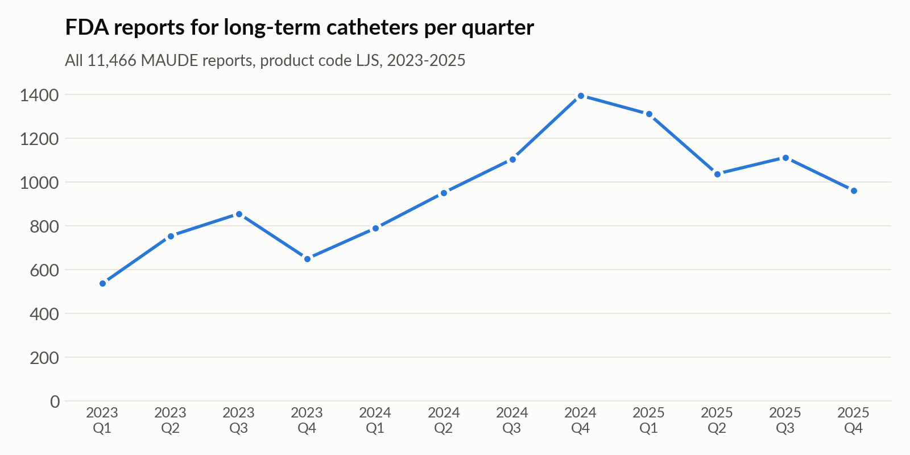
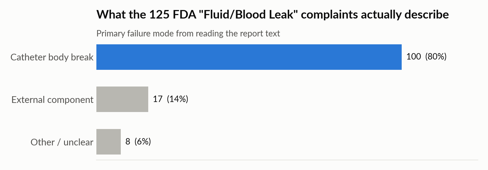
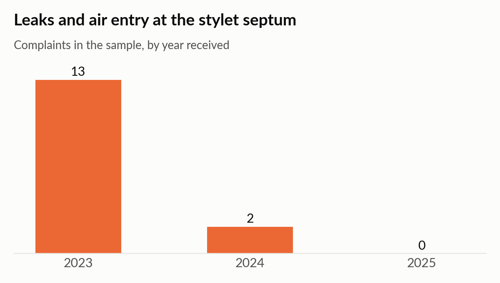
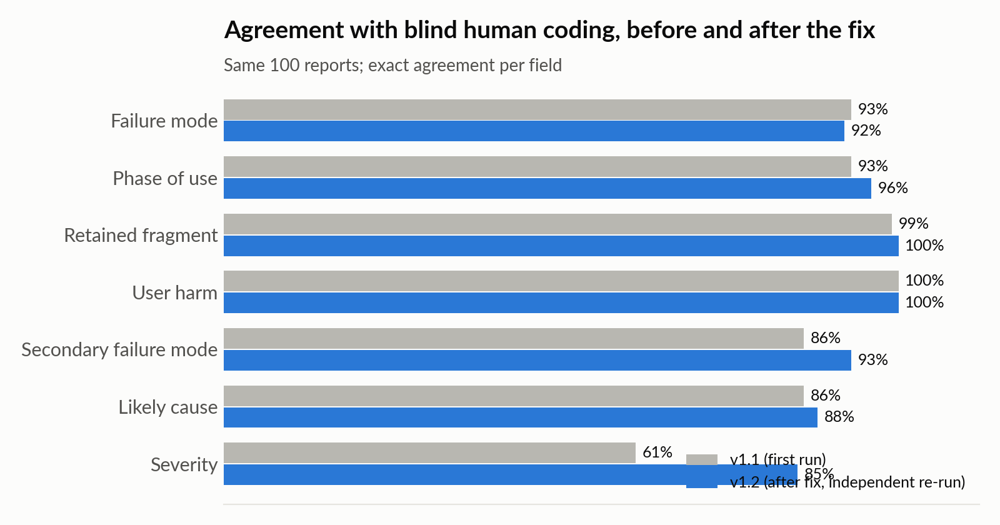

# AI-assisted post-market surveillance of long-term central venous catheters

**A validated prototype using FDA MAUDE adverse event reports, 2023-2025**

Parsa Vafaei, MSc Biomedical Engineering, University of Sheffield · October 2026

---

## Summary

This project tested whether a large language model can support post-market surveillance (PMS)
trend review for a medical device, and what a regulatory reviewer must keep in human hands.

FDA MAUDE reports for long-term implanted intravascular catheters (product code LJS, including
PICCs) were coded by an AI model against a fixed set of failure-mode, severity and phase rules
derived from ISO 14971 risk management practice. The results were compared with a reference
design-stage FMEA and validated against blind manual coding.

**Key results**

- **The FDA "Fluid/Blood Leak" code hides breakage.** 80% of complaints carrying that code
  (100 of 125) describe a breach of the catheter body when the text is read.
- **Catheter body breaks are the growing failure mode,** rising from 28% of complaints in 2023
  to 49% in 2024 and 54% in 2025, while hub and connector failures fell from 32% to 7%.
- **A component signal appeared and faded:** leaks and air entry at the stylet septum made up
  13 complaints in 2023, 2 in 2024 and none in 2025.
- **The reference FMEA missed hazards seen in the field:** insertion accessories (14% of
  complaints, a third of retained fragments), air entry, kinking, malposition, extravasation and
  harm to users.
- **Validation:** the AI agreed with blind expert coding on the failure mode in 93% of 100
  reports (Cohen's kappa 0.90). Severity agreement was only 61% (kappa 0.44), with the AI
  rating harm lower. After a rule fix and an independent re-run it rose to 85% (kappa 0.78).

**Conclusion:** the tool is fit for its intended use as decision support for failure-mode
trending, provided severity and every serious event are reviewed by a person.

---

## 1. Background and aim

Manufacturers must collect and review post-market data and feed it back into their risk
management file (EU MDR Article 83-86, UK MDR, ISO 14971 clause 10). Complaint and adverse event
narratives are free text, and reading them is slow. Public databases such as MAUDE add a further
problem: their coded fields are coarse and are assigned by many different reporters.

The aim was to build a small, transparent prototype that:

1. extracts real-world adverse event data for one device type,
2. uses AI to classify each report against defined failure-mode and severity rules,
3. compares the real-world picture with a design-stage FMEA, and
4. measures how far the AI can be trusted, using blind human review.

## 2. Intended use

The tool supports PMS trend review for long-term central venous catheters by suggesting a
failure mode, harm severity, phase of use and likely contributor for each report, with a
supporting quote. It does **not** decide whether an event is reportable, replace complaint
handling or vigilance processes, calculate incidence rates, or inform clinical decisions. Every
AI output is reviewed by a person. Full statement: `docs/01_intended_use.md`.

## 3. Method

**Data.** All 11,466 MAUDE reports with product code LJS received between January 2023 and
December 2025 were identified through the openFDA device event API. 1,600 report narratives
were downloaded (100 from each quarter, plus 500 from Q1 2023), and a balanced sample of 1,200
(100 per quarter) was built. Midline catheters were excluded because their hazards differ from
central lines.

**Coding rules.** Thirteen failure-mode categories were defined (e.g. FM01 catheter body break,
FM02 external component failure, FM05 insertion accessory failure), each with inclusion and
exclusion criteria, priority rules for reports that fit more than one category, a five-level
severity scale, phase of use, likely contributor, retained-fragment and user-harm flags. The
categories were reviewed against a reference design-stage FMEA for a comparable catheter and
refined after a 20-report pilot (`docs/02_failure_mode_categories.md`).

**AI classification.** 300 reports (25 per quarter, random, excluding pilot reports) were coded
by Claude (Anthropic) with a fixed prompt and the written rules. Voided duplicate reports were
removed and reports describing the same complaint were grouped, giving 288 unique complaints.

**Validation.** 100 of the 300 reports, stratified by year, were coded independently by the
author without seeing the AI labels. Agreement was measured per field, with Cohen's kappa to
correct for chance agreement.

**Re-test.** Root causes of disagreement were corrected (rules v1.2) and the 100 reports were
re-coded by a separate Claude instance that had access only to the rules and the report text.

## 4. Results

### 4.1 Overall picture

Reports for this product code rose from 2,799 in 2023 to 4,243 in 2024 and 4,424 in 2025,
peaking at 1,396 in Q4 2024. A rise in report numbers can reflect more devices in use, changes
in reporting practice or field actions, so it was treated as a reason to look closer, not as a
finding on its own.

Across the 288 complaints, catheter body breaks were the largest group (44%), followed by
external component failures (17%) and insertion accessory failures (14%). Most events occurred
during use (59%) or insertion (26%). 34 complaints (12%) were rated serious (S3) or critical
(S4); 15 involved a retained fragment and 2 involved harm to a user.

### 4.2 What the FDA "leak" code hides

The FDA problem code "Fluid/Blood Leak" was the most frequent code in the data and its share
rose from 2023 to 2024. Reading the narratives, 100 of the 125 leak-coded complaints were
catheter body breaks: fractures, splits, holes or cracks in the tube. A surveillance process
that trends coded fields alone would see "leaks" rising and could miss that the underlying
hazard is breakage, the failure mode the reference FMEA rated most severe.

### 4.3 Trends by failure mode

Catheter body breaks rose from 28% of complaints in 2023 to 54% in 2025. Manufacturer
investigations attributed 42 of them to flexural fatigue (repeated kinking of the tube, often a
few centimetres from the exit site or securement device), rising from 7 in 2023 to 19 in 2025.
External component failures fell from 32% to 7%.

### 4.4 A signal that appeared and faded

In 2023, 13 complaints described saline leaking or air being drawn in at the rubber septum that
holds the stylet at the catheter hub. Several reporters linked this to a new stopper design, and
the manufacturer confirmed a manufacturing or supplier cause in some reports. Two such complaints
appeared in 2024 and none in 2025, consistent with a problem being found and corrected. Air entry
through this part is an air embolism hazard. This is the type of cluster PMS trend review exists
to catch early.

## 5. Validation and re-test

| Field | First run (v1.1) | After fix (v1.2) |
|---|---|---|
| Primary failure mode | 93% (kappa 0.90) | 92% (kappa 0.89) |
| Phase of use | 93% (0.88) | 96% (0.93) |
| Secondary failure mode | 86% (0.61) | 93% (0.83) |
| Likely contributor | 86% (0.62) | 88% (0.75) |
| **Severity** | **61% (0.44)** | **85% (0.78)** |
| Retained fragment | 99% (0.93) | 100% (1.00) |
| User harm | 100% (1.00) | 100% (1.00) |

The AI identified the failure mode reliably from the start. Severity was the weak point: in 38
of 39 disagreements the human reviewer rated harm higher, mostly where a line had to be replaced.
Two root causes were found. The rule did not say clearly how to rate an unplanned line
replacement, and the AI had been given a shortened manufacturer narrative. Both were fixed and
the re-run raised severity agreement to 85%.

The remaining severity differences still all lean the same way (AI lower), and under-rating
harm is the less safe error in PMS. Severity therefore stays under human review. Because the
v1.2 rule was written after seeing the disagreements and was tested on the same reports, the
re-test shows that the clarified rule removes most of the ambiguity; it is not a fully
independent accuracy estimate.

## 6. Comparison with the reference FMEA

| Finding | Implication for the risk file |
|---|---|
| Line breakage is the most frequent failure mode (44%) and caused 10 of 15 retained fragments | Residual likelihood of 1 after controls is not supported; add flexural fatigue, over-pressurisation and removal damage as causes |
| Insertion accessories: 14% of complaints, 5 retained fragments, guidewire fragments in the heart | Add as separate failure modes with fragment retention |
| Air entry at septa and connectors | Add air embolism as a hazard |
| Kinking, malposition (including arterial placement with stroke), extravasation of chemotherapy | Add as failure modes or hazardous situations |
| Blood splash and sharps injury to nurses | Add harm to users, as ISO 14971 requires |
| Infection and thrombosis rarely reported in MAUDE | Monitor through other PMS sources (literature, registries) |

Full comparison: `docs/07_fmea_comparison.md`.

## 7. Limitations

- MAUDE is subject to under-reporting, missing detail and duplicate reports, has no data on
  devices in use, and describes allegations rather than confirmed causes.
- The sample is 25 reports per quarter, concentrated in the first month of each quarter, so
  percentages describe the sample rather than the full population.
- About 80% of reports come from one manufacturer group; results must not be used to compare
  manufacturers.
- Validation used one human reviewer, who also wrote the coding rules.
- The AI coding was performed with Claude in an interactive session rather than a fixed API
  pipeline with recorded model version and settings.

## 8. Conclusions

1. An AI model can classify free-text adverse event reports into defined failure modes with
   agreement close to a human reviewer (kappa 0.89-0.90), making it useful for PMS trend review.
2. Severity judgement is where AI and human differ most; it needs explicit rules and human review.
3. Reading the narrative changes the picture: coded fields alone would have reported a rise in
   "leaks" rather than a rise in catheter breakage.
4. Real-world data exposed hazards a design-stage FMEA did not consider, which is the purpose of
   the PMS-to-risk-management feedback loop.

## Project files

| Folder / file | Contents |
|---|---|
| `docs/` | intended use, coding rules, data summary, method, results, validation, FMEA comparison, progress log |
| `data/raw/` | openFDA downloads |
| `data/processed/` | cleaned reports, samples, AI labels, validation comparison |
| `data/rerun/` | v1.2 inputs, re-run labels and comparison |
| `scripts/` | data extraction, sampling, comparison and figure scripts (Python standard library + openpyxl, matplotlib) |
| `figures/` | report figures |
| `skill/` | the coding method packaged as a Claude skill |
