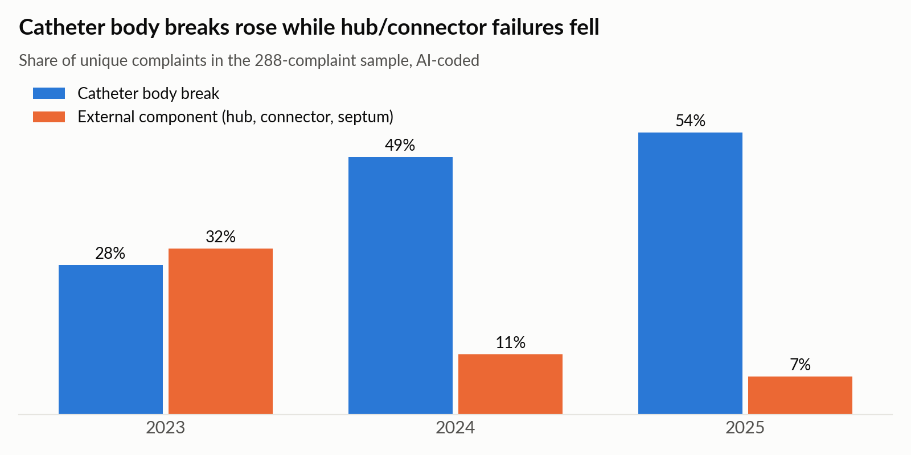

# 7. Real-world data vs the reference FMEA (step 6)

*October 2026. Compares the 288 AI-coded complaints (`docs/05_ai_classification_results.md`)
with the reference design-stage FMEA (`docs/fmea_reference.md`). The FMEA was written for a
comparable catheter at design stage; MAUDE describes marketed devices from several manufacturers.
The comparison therefore tests whether the FMEA's hazard list and ratings would hold up in the
field, not the performance of one product.*

"Primary" = complaints where this was the main failure mode. "Mentions" also counts complaints
where it was the secondary failure mode. "Serious" = severity S3 or above.

## FMEA rows vs field data

| FMEA row | FMEA rating (L x S, initial / residual) | Field data (n = 288) | Assessment |
|---|---|---|---|
| 2. Line breaks | 3x5=15 / 1x5=5 | **126 primary (44%)**, 18 serious, **10 retained fragments** | Most common failure mode and the main source of serious harm. A residual likelihood of 1 is not supported for this device type. Manufacturer investigations point to flexural fatigue near the exit site and securement device, which the FMEA's controls (material choice, fatigue testing) do not fully address. |
| 5. Cap or clamp fails | 4x4=16 / 1x4=4 | 48 primary (17%), none serious | Frequent but low harm in practice; severity 4 looks conservative. The FMEA does not capture **air entry** through a faulty septum, seen in a 2023 cluster. |
| 7. Resistance when drawing or infusing | 4x3=12 / 1x3=3 | 11 primary, 30 mentions (10%), 1 serious | Consistent with the FMEA. Usually a consequence of kinking or breakage, not a stand-alone cause. |
| 1. Not sterile / 4. Re-used | 4x5=20 / 1x5=5 | 18 packaging, labelling or assembly defects found **before use**; no infection linked to them; no re-use reports | Controls (inspection, labelling) appear to work: defects are caught before use. |
| 6. Thrombosis | 3x3=9 / 2x3=6 | 3 primary, 6 mentions, all serious | Under-represented in MAUDE because reporters rarely attribute thrombosis to the device. Needs other PMS sources. |
| 3. Rejected by the body | 2x5=10 / 1x5=5 | 4 primary, 5 mentions, 1 critical (allergic reaction with seizure, chlorhexidine) | Rare. The FMEA treats it as material biocompatibility; the field case involved an antimicrobial agent. |
| 8. Foreign liquid enters line | 4x4=16 / 2x4=8 | none observed | Not reported in MAUDE; would rely on complaint and clinical data. |

## Hazards in the field data with no FMEA row

| Field category | Primary / mentions | Serious | Retained fragments | Example |
|---|---|---|---|---|
| Insertion accessory failure (guidewire, stylet, sheath, tunneller, tip-location system) | 41 / 43 (14%) | 3 | **5** | guidewire tip found in the right atrium months later; cardiac surgery |
| Kink / deformation | 15 / 27 | 0 | 0 | 4-6 kinked PICCs at single sites within days |
| Vessel injury / extravasation | 2 / 12 | 2 | 0 | chemotherapy extravasation needing plastic-surgery review |
| Malposition / migration | 4 / 6 | 1 | 0 | arterial placement confirmed as venous by tip-location system; stroke |
| Difficult insertion / removal | 2 / 6 | 0 | 0 | catheter stuck from venous spasm |
| Harm to users | 2 complaints | | | blood splash to the eye from an HIV-positive patient; sharps injury from a kit blade |

## Recommended updates to the FMEA

1. **Raise the residual likelihood of line breakage** and add failure causes for flexural fatigue at the exit site and securement point, over-pressurisation (small syringes, forced flushing of occluded lines) and damage during removal.
2. **Add insertion accessories as their own failure modes**, including fragment retention, which caused a third of the retained fragments in the sample.
3. **Add air entry** through septa, valves and connectors as a hazard (air embolism).
4. **Add kinking**, malposition (including arterial placement) and extravasation of vesicant drugs.
5. **Add harm to users** (blood exposure, sharps), as ISO 14971 requires.
6. **Feed PMS back into the FMEA**: define which data sources monitor hazards MAUDE under-reports (thrombosis, infection), e.g. literature review and registry data.

